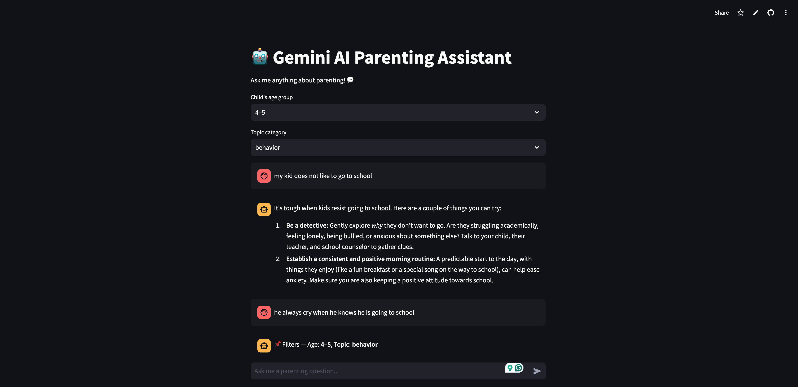

# Gemini AI Parenting Assistant

> _“Ask me anything about parenting — I’ll respond like a calm, supportive coach.”_

An interactive AI parenting coach powered by **Google Gemini 2.0 Flash Lite**, built with **Streamlit**, **FastAPI**, and **ChromaDB**.  
It provides personalized, empathetic guidance for parents — tailored by a child’s **age group**, **behavior topic**, and conversation tone.

---

## 🌟 Demo

  
_(Example question: “My kid doesn’t like to go to school.”)_

---

## Features

- Age- and topic-aware parenting answers  
- Real-time AI replies using **Gemini 2.0 Flash Lite**  
- Emotional tone adaptation via **VADER Sentiment Analysis**  
- Cognitive-intent tuning using **Bloom’s Taxonomy**  
- Local knowledge retrieval with **ChromaDB**  
- Seamless backend powered by **FastAPI + Render**

---

## Tech Stack Overview

| Layer          | Tools                                         |
| -------------- | --------------------------------------------- |
| **Frontend**   | Streamlit                                     |
| **Backend**    | FastAPI                                       |
| **Model**      | Google Gemini 2.0 Flash Lite                  |
| **Database**   | ChromaDB                                      |
| **NLP**        | VADER Sentiment Analyzer                      |
| **Env Mgmt**   | dotenv                                        |
| **Deployment** | Render (backend) + Streamlit Cloud (frontend) |

---

## Deployment

| **Component**       | **Platform**                                    |
| ------------------- | ----------------------------------------------- |
| **Backend**         | [Render ↗](https://render.com)                  |
| **Frontend**        | [Streamlit Cloud ↗](https://streamlit.io/cloud) |
| **Environment Var** | `GOOGLE_API_KEY` — set in Render Settings       |

---

## Performance Tips

Use "gemini-2.0-flash-lite" for fastest responses
Keep prompt context under ≈ 500 characters
Run Chroma locally for low-latency retrieval

## Author

**Nicole Chen**  
AI & Data Science | University of Michigan
[LinkedIn ↗](https://www.linkedin.com/in/nicoolesy) | [GitHub ↗](https://github.com/nicoolesy)

> 🧡 _Built to help parents understand, connect, and grow together — one gentle conversation at a time._
